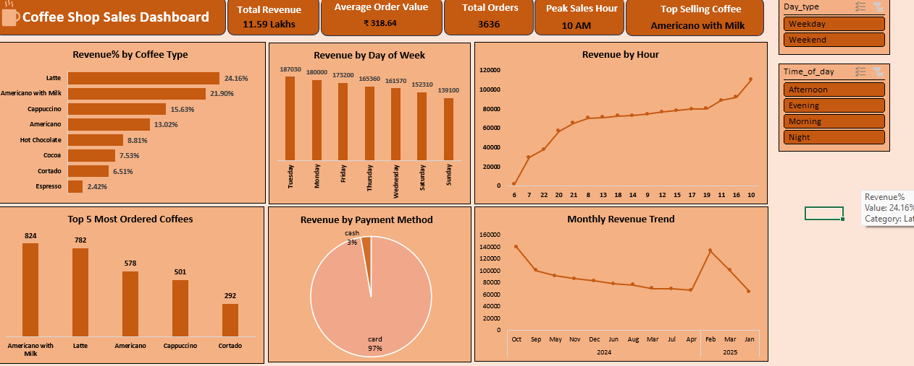

# Coffee-Shop-Sales-Analysis-Dashboard-Excel-

# Business Problem
A coffee shop had 3,636 transaction records but lacked visibility into sales performance, customer preferences, peak business hours, and product-level revenue contributions. 
Decision-makers could not easily identify which products and time periods were driving business performance.

# Project Goal
Analyze sales data and build an interactive Excel dashboard to answer key business questions related to revenue, customer behavior, product performance, sales trends, and payment preferences.

# Analysis Performed
* Cleaned and transformed raw transaction data in Excel.
* Created Pivot Tables and Pivot Charts to analyze revenue, orders, product sales, and customer purchasing patterns.
* Built an interactive dashboard using Slicers, KPIs, and dynamic visualizations.
* Analyzed sales performance across weekdays, weekends, and different time periods (Morning, Afternoon, Evening, and Night).
* Evaluated product-level revenue contribution, peak sales hours, and payment method usage.

# Key Insights
* Analyzed ₹11.59 Lakhs in revenue generated from 3,636 orders.
* Identified that Latte and Americano with Milk contributed nearly 46% of total revenue.
* Discovered changing customer preferences throughout the day, with different products leading sales in Morning, Afternoon, Evening, and Night periods.
* Found that weekdays generated higher revenue per day than weekends, indicating stronger weekday customer activity.
* Revealed that 96–98% of transactions were completed through digital payments.

## Business Outcome

Converted raw transaction data into actionable business insights, enabling a clear understanding of customer behavior, revenue drivers, peak demand periods, and sales trends through a single interactive Excel dashboard.

## Tools Used

* Microsoft Excel
* Pivot Tables
* Pivot Charts
* Slicers
* KPI Calculations
* Data Cleaning
* Dashboard Design
